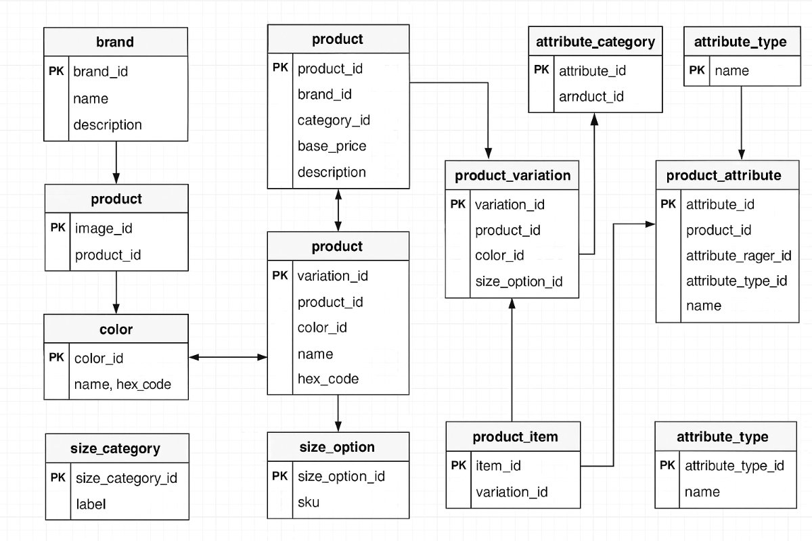

# 🛍️ E-commerce Database Project

**Group 276**  
MySQL Relational Database for an E-Commerce Platform

---

## 📦 Project Overview

This project is a comprehensive relational database design tailored for an e-commerce platform. It includes detailed schema definitions, sample data for testing, and an entity-relationship diagram (ERD) to visualize the structure. The schema supports multiple product variations, inventory management, and attribute flexibility.

---

## 🗂️ Project Files

- `ecommerce.sql` – Full schema creation script
- `insert_sample.sql` – Sample data insertion script
- `E-commerce-Database.drawio.png` – Entity-Relationship Diagram (ERD)
- `README.md` – Project documentation

---

## 🧠 ERD Diagram



> Diagram includes all tables such as `brand`, `product`, `category`, `color`, `product_variation`, `product_item`, and attribute-related entities.

---

## 🧪 How to Run

1. **Create Tables**  
   Run `ecommerce.sql` in your MySQL client (like MySQL Workbench, dbdiagram.io, or DBeaver).

2. **Insert Sample Data**  
   Run `insert_sample.sql` after table creation to populate the database with example brands, products, colors, sizes, and SKUs.

3. **Query**  
   Use SQL queries to explore the data and test relationships.

---

## 🔍 Sample SQL Queries

```sql
-- 1. View all products
SELECT * FROM product;

-- 2. Join products with brand and category
SELECT p.name AS Product, b.name AS Brand, c.name AS Category
FROM product p
JOIN brand b ON p.brand_id = b.brand_id
JOIN product_category c ON p.category_id = c.category_id;

-- 3. Find products over $1000
SELECT p.name, p.base_price FROM product p
WHERE p.base_price > 1000;

-- 4. Get product by SKU
SELECT pi.sku, p.name, pi.price, pi.stock_quantity
FROM product_item pi
JOIN product_variation pv ON pi.variation_id = pv.variation_id
JOIN product p ON pv.product_id = p.product_id
WHERE pi.sku = 'SKU12345';


🛠️ Tools & Technologies

Database: MySQL

Design Tools: dbdiagram.io, draw.io

Development: Visual Studio Code, Git, GitHub


🧑‍🤝‍🧑 Teamwork

This project was completed by Group 276 as part of a database design assignment. Responsibilities were shared among members for schema design, sample data generation, ERD visualization and documentation.
